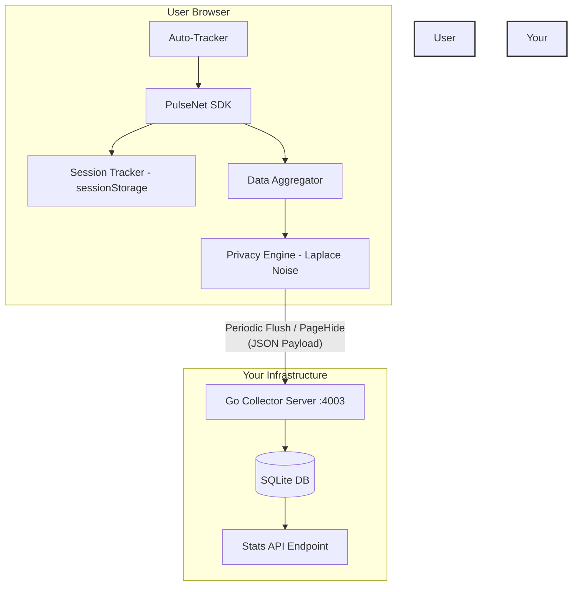

<!--
// Copyright (c) 2024-2026 Soumya Debnath. All Rights Reserved.
// Licensed under the Business Source License 1.1 (BSL 1.1).
// See LICENSE file for details. Production use requires a paid license.
// Contact: soumyadebnath1661@gmail.com | +91 7031648617
-->

<div align="center">
  <h1>PulseNet</h1>
  <p><strong>Privacy-First Analytics with Differential Privacy — Self-Hosted, Zero Cookies, Zero PII.</strong></p>

  [](https://mariadb.com/bsl11/)
  [](#known-limitations)
  [](#privacy-architecture)
  [](#gdprccpa-compliance)
</div>

---

## Table of Contents
1. [What is PulseNet?](#what-is-pulsenet)
2. [Why PulseNet? (Cost & Comparison)](#why-pulsenet-cost--comparison)
3. [Architecture](#architecture)
4. [Privacy Architecture & Differential Privacy](#privacy-architecture--differential-privacy)
5. [Why Ad Blockers Can't Block It](#why-ad-blockers-cant-block-it)
6. [GDPR & CCPA Compliance](#gdpr--ccpa-compliance)
7. [Installation & Setup](#installation--setup)
8. [Usage Examples](#usage-examples)
9. [API Reference](#api-reference)
10. [Aggregated Payload Specification](#aggregated-payload-specification)
11. [Server Deployment & API](#server-deployment--api)
12. [Known Limitations](#known-limitations)
13. [FAQ](#faq)
14. [Author & Support](#author--support)

---

## What is PulseNet?

PulseNet is a complete, self-hosted, privacy-first analytics alternative to Google Analytics, Mixpanel, and Amplitude. It provides you with rich, actionable insights about your users without ever tracking an individual user, placing a cookie, or collecting Personally Identifiable Information (PII).

**Key Innovations:**
- **On-Device Aggregation:** Data is aggregated on the user's browser over an interval.
- **Differential Privacy (Laplace Noise):** We inject cryptographic noise on the client before the data ever touches your server.
- **Zero Cookies / Zero PII:** We use ephemeral `sessionStorage` strictly for tracking active session time. We do not fingerprint, track IPs, or use third-party cookies.
- **Impossible to Block:** Because it runs on first-party domains and doesn't load external tracking scripts, uBlock Origin and Brave Shields won't block it.
- **Zero Cost:** Deploy the ultra-lightweight Go server anywhere (fly.io, Render, your own VPS) for pennies or completely free.

---

## Why PulseNet? (Cost & Comparison)

Tired of paying thousands of dollars for Mixpanel, or dealing with the bloated, privacy-invasive nightmare of Google Analytics 4?

### The Cost Savings
| Monthly Tracked Users | Google Analytics 360 | Mixpanel | Plausible / Fathom | **PulseNet** |
|-----------------------|----------------------|----------|--------------------|--------------|
| 10,000                | Free (Invasive)      | Free     | ~$14/mo            | **$0**       |
| 100,000               | Free (Invasive)      | $20+/mo  | ~$49/mo            | **$0**       |
| 1,000,000             | Free (Invasive)      | $1000+/mo| ~$150+/mo          | **$0 (or $5 VPS)** |
| 10,000,000            | $150,000/yr          | Custom   | Custom             | **$0 (or $20 VPS)** |

### Feature Comparison

| Feature                     | PulseNet           | Google Analytics   | Mixpanel         | Plausible       |
|-----------------------------|--------------------|--------------------|------------------|-----------------|
| **Data Ownership**          | 100% Yours         | Google's           | Mixpanel's       | Cloud / Yours   |
| **Differential Privacy**    | Yes                | No                 | No               | No              |
| **Cookie-free**             | Yes (always)       | No (usually)       | No (usually)     | Yes             |
| **GDPR/CCPA compliant**     | Yes (by design)    | Requires config    | Requires config  | Yes             |
| **Bypasses Ad Blockers**    | Yes (1st party)    | Blocked            | Blocked          | Partially       |
| **SPA / History API Ready** | Automatic          | Manual config      | Manual config    | Yes             |

---

## Architecture

PulseNet consists of two primary components:
1. **The Client SDK (TypeScript):** Runs in the browser, aggregates data, applies Laplace noise, and flushes payloads periodically or on page close.
2. **The Collector Server (Go):** Extremely fast, lightweight SQLite-backed server that ingests pre-aggregated, anonymized payloads.



---

## Privacy Architecture & Differential Privacy

PulseNet doesn't just promise privacy; it guarantees it mathematically using Differential Privacy (DP).

### How it works:
Instead of sending real-time events (e.g., "User A clicked Button B at 10:04 AM"), PulseNet accumulates events in memory for a period (e.g., 60 seconds). Before sending this aggregated data to the server, it applies **Laplace Noise**.

### The Math:
For any count metric (page views, event clicks, sessions), the reported value is:
`Reported Value = True Value + Laplace(0, Δf / ε)`

- `Δf` (Sensitivity): The maximum change a single user can have on the output. (In PulseNet, this is 1).
- `ε` (Epsilon): The privacy budget. A lower epsilon means more privacy (more noise). By default, PulseNet uses ε = 1.0.
- The random noise is generated securely using inverse transform sampling:
  ```typescript
  const u = Math.random() - 0.5;
  const noise = (1 / epsilon) * Math.sign(u) * Math.log(1 - 2 * Math.abs(u));
  ```

Because of this noise, **it is mathematically impossible for the server to determine if a specific user took a specific action**. When aggregated over thousands of users, the random noise cancels out (mean = 0), leaving you with highly accurate aggregate statistics.

---

## Federated P2P Aggregation

PulseNet optionally supports a `FederatedAggregator` class that gossips pre-noised aggregate buckets between browsers over WebRTC DataChannels, reducing server intake requests. This is an experimental feature exposed via the `FederatedAggregator` export — it does not run by default when you instantiate `PulseNet`.

### Research Foundations
> **Research Citations:**
> - Dwork, C., & Roth, A. (2014). *The Algorithmic Foundations of Differential Privacy*. Foundations and Trends in Theoretical Computer Science, 9(3-4), 211-407.
> - Bonawitz, K., et al. (2017). *Practical Secure Aggregation for Privacy-Preserving Machine Learning*. ACM CCS 2017. [arXiv:1611.04482](https://arxiv.org/abs/1611.04482)

---

## Why Ad Blockers Can't Block It

Traditional analytics like Google Analytics load external scripts (e.g., `www.google-analytics.com/analytics.js`). Ad blockers maintain lists (like EasyPrivacy) of these domains and block them entirely.

**PulseNet bypasses this because:**
1. **It's bundled in your app:** You import PulseNet directly into your React/Vue/Vanilla JS app. There is no external `<script>` tag.
2. **It uses your domain:** You deploy the Go server to a subdomain (e.g., `analytics.yourdomain.com`) or proxy it through your main API. Ad blockers do not block first-party requests.
3. **No tracking payloads:** The payload looks like application metrics, not tracking data. No device IDs, user IDs, or IPs are sent.

---

## GDPR & CCPA Compliance

PulseNet is designed to be compliant with global privacy regulations **out of the box**, without needing a cookie consent banner.

- **No PII:** We never collect IP addresses, emails, or names.
- **No Fingerprinting:** We do not read device capabilities to create a persistent fingerprint.
- **No Cookies:** We use `sessionStorage` strictly to measure how long a single tab session lasts. `sessionStorage` is cleared immediately when the tab is closed.
- **Right to be Forgotten:** Since we never store individual data, there is no personal data to delete upon request.

You **do not** need a Cookie Banner to use PulseNet.

---

## Installation & Setup

> **PulseNet is not published on npm.** The package name `pulsenet` is not registered. Do not run `npm install pulsenet`.

### Option A: jsDelivr CDN from GitHub (no build step)

```html
<script type="module">
  import { PulseNet } from 'https://cdn.jsdelivr.net/gh/itsoumya-d/pulsenet@main/dist/index.mjs';

  const analytics = new PulseNet({
    appId: 'my-production-app',
    endpoint: 'https://analytics.mydomain.com/api/collect',
  });
</script>
```

### Option B: Build from source

```bash
git clone https://github.com/itsoumya-d/pulsenet.git
cd pulsenet
npm install
npm run build
```

Then import from `./dist/index.mjs` in your project.

### Basic Initialization

Initialize PulseNet as early as possible in your application lifecycle.

```typescript
import { PulseNet } from './dist/index.mjs';

const analytics = new PulseNet({
  appId: 'my-production-app',
  endpoint: 'https://analytics.mydomain.com/api/collect',
  flushInterval: 60000, // Aggregate and send every 60 seconds
  debug: process.env.NODE_ENV !== 'production'
});
```

---

## Usage Examples

### Basic Tracking

PulseNet automatically hooks into the History API and window load events. Page views and initial performance metrics are tracked automatically!

### Tracking Custom Events

Track interactions, button clicks, or application states.

```typescript
// User signs up
analytics.track('user_signup');

// User upgrades plan
analytics.track('plan_upgraded');

// User clicks a critical CTA
document.getElementById('checkout-btn').addEventListener('click', () => {
  analytics.track('checkout_clicked');
});
```
*Note: Custom properties on events are intentionally omitted in the current SDK to maintain Differential Privacy guarantees.*

### Single Page Applications (SPA) Support

PulseNet patches `history.pushState` and listens to `popstate` events. If you are using React Router, Next.js, or Vue Router, **you do not need to do anything**. Page views are recorded automatically.

If you need to manually trigger a page view:
```typescript
analytics.pageView('/custom/virtual/path');
```

### Custom Timing Metrics

Track how long certain operations take:
```typescript
const start = performance.now();
// ... heavy computation or API call ...
const end = performance.now();

analytics.timing('api_latency', 'fetch_users', end - start);
```

---

## API Reference

### `class PulseNet`

**Real package name: `pulsenet`** (not `@pulsenet/browser` or `@pulsenet/core` — those do not exist).

#### `constructor(options: PulseNetOptions)`
Initializes the SDK.
- `options.appId` (string, required): A unique identifier for your app.
- `options.endpoint` (string, required): The URL of your PulseNet Go Collector server.
- `options.flushInterval` (number, optional): Milliseconds between data flushes. Default: `60000`.
- `options.debug` (boolean, optional): Enable console logging. Default: `false`.

#### `track(event: string)`
Records a custom event. The count of this event will be aggregated, noised, and sent during the next flush.

#### `pageView(path?: string)`
Records a page view. If `path` is omitted, it defaults to `window.location.pathname`. Also captures `document.referrer`.

#### `timing(category: string, variable: string, durationMs: number)`
Records a timing metric. The SDK will compute p50, p95, and p99 percentiles locally before flushing.

#### `enable() / disable()`
Temporarily pause or resume tracking.

#### `flush()`
Manually forces the aggregator to calculate noise and send the payload immediately. (Automatically called on `pagehide` / `visibilitychange`).

#### `destroy()`
Clears timers, flushes remaining data, and cleans up the SDK.

### `class FederatedAggregator`

Experimental class for gossip-based P2P pre-aggregation. Not enabled by default.

- `connect(signalingUrl: string, channelId: string)`: Connect to a signaling server for peer discovery.
- `addPeer(channel: RTCDataChannel)`: Register a WebRTC data channel with a peer.
- `shareLocalAggregates(epsilon?: number, sensitivity?: number)`: Broadcast noised local aggregates to connected peers.
- `receivePeerData(msg: GossipMessage)`: Merge a peer's aggregate into the global aggregate.
- `getGlobalAggregate()`: Get the current merged aggregate.

---

## Aggregated Payload Specification

When PulseNet flushes data, it sends a POST request with an `application/json` body. Here is exactly what the server sees. Notice there is **no user-level data**:

```json
{
  "appId": "my-production-app",
  "period": {
    "start": 1690000000,
    "end": 1690000060
  },
  "pageViews": {
    "/home": 45,
    "/pricing": 12
  },
  "events": {
    "checkout_clicked": 8,
    "signup_completed": 3
  },
  "sessions": {
    "count": 15,
    "avgDurationSec": 240,
    "bounceRate": 0.25
  },
  "timing": {
    "performance:page_load": {
      "p50": 340,
      "p95": 890,
      "p99": 1200
    }
  },
  "referrers": {
    "google.com": 8,
    "twitter.com": 4
  },
  "devices": {
    "desktop": 1
  },
  "noiseLevel": 1.0
}
```

---

## Server Deployment & API

The PulseNet backend is a Go server using SQLite. It compiles to a single binary.

### 1. Build and Run via Docker

A `Dockerfile` is included in the `/server` directory.

```bash
cd server
docker build -t pulsenet-server .
docker run -p 4003:4003 -v $(pwd)/data:/app/data pulsenet-server
```
*(Ensure you mount a volume so your SQLite database persists!)*

### 2. Run locally (Go required)

```bash
cd server
go mod download
go build -o pulsenet-server
./pulsenet-server
```
*Starts server on port `:4003`.*

### REST API Endpoints

#### `GET /api/stats?appId={appId}`
Returns total aggregated page views and events across all time.

#### `GET /api/sessions?appId={appId}`
Returns session metrics.

#### `POST /api/collect`
The ingestion endpoint used by the SDK. Expects the `PulseNetPayload`.

---

## Known Limitations

- **Pre-release software.** API may change. No production adopters are known yet.
- **Not published on npm.** The package name `pulsenet` on npm is not registered. Use jsDelivr CDN or build from source (see Installation).
- **No TURN relay.** The optional `FederatedAggregator` creates WebRTC peer connections for gossip aggregation. Those connections use **STUN-only ICE configuration** — there is no TURN server. STUN cannot traverse symmetric NAT (common on corporate networks) or many mobile carrier-grade NAT deployments; those peers will fail to connect. The `FederatedAggregator` does not surface a distinct "ICE failed" error — a failed connection silently prevents that peer from contributing to the aggregate. If you use `FederatedAggregator` and need reliable connectivity across arbitrary networks, supply your own TURN server and pass the `iceServers` array to the `RTCPeerConnection` constructor in a fork.
- **Browser-only SDK.** Node.js is not supported (the SDK references `window`, `document`, `sessionStorage`).
- **Go server required for data persistence.** The client-side SDK alone does not store or visualize data.
- **Differential Privacy noise at low volumes.** With fewer than ~100 events per flush interval, Laplace noise adds measurable inaccuracy. This is expected behavior, not a bug.

---

## FAQ

**Q: If the data has random noise, isn't it inaccurate?**
A: Because the noise is drawn from a Laplace distribution centered at zero, the noise cancels out as your sample size grows. If 10,000 users visit your site, the noise added will typically be between -3 and +3. An error margin of 3 on 10,000 visitors is statistically insignificant, but mathematically prevents tracing an individual.

**Q: What happens if a user closes the tab before the 60-second flush interval?**
A: The SDK hooks into the `visibilitychange` and `pagehide` browser events. When the user navigates away or closes the tab, a final payload is instantly dispatched using the `navigator.sendBeacon()` API (or a keepalive `fetch`), ensuring zero data loss.

**Q: Can I use this with Next.js or Nuxt?**
A: Yes. Simply instantiate the PulseNet class in a client-side `useEffect` or `onMounted` hook.

**Q: Does the backend support Postgres or MySQL?**
A: Currently, the backend uses `modernc.org/sqlite` for extreme simplicity, zero-dependency deployment, and fast read/writes via WAL mode.

---

## Author & Support

**Soumya Debnath**
- Email: [soumyadebnath1661@gmail.com](mailto:soumyadebnath1661@gmail.com)
- Phone: +91 7031648617

---

## License — Business Source License 1.1

> **Source-available, NOT open-source. All production use requires a paid license.**
> Replaces: Google Analytics, Mixpanel

| Tier | Price | For |
|:-----|:------|:----|
| **Indie** | $199/year | Solo developer, <$100K revenue |
| **Startup** | $1,499/year | Up to 10-25 devs, <$5M revenue |
| **Enterprise** | $7,999/year | Unlimited seats, unlimited revenue |
| **OEM / White-Label** | $14,999/year | Embed in your product |
| **Full IP Buyout** | $500,000 | Complete ownership transfer |

**Free use limited to:** Personal evaluation, academic research, contributing via PRs.

[soumyadebnath1661@gmail.com](mailto:soumyadebnath1661@gmail.com) · [+91 7031648617](tel:+917031648617) · [github.com/itsoumya-d](https://github.com/itsoumya-d)

© 2024-2026 Soumya Debnath. All Rights Reserved.
