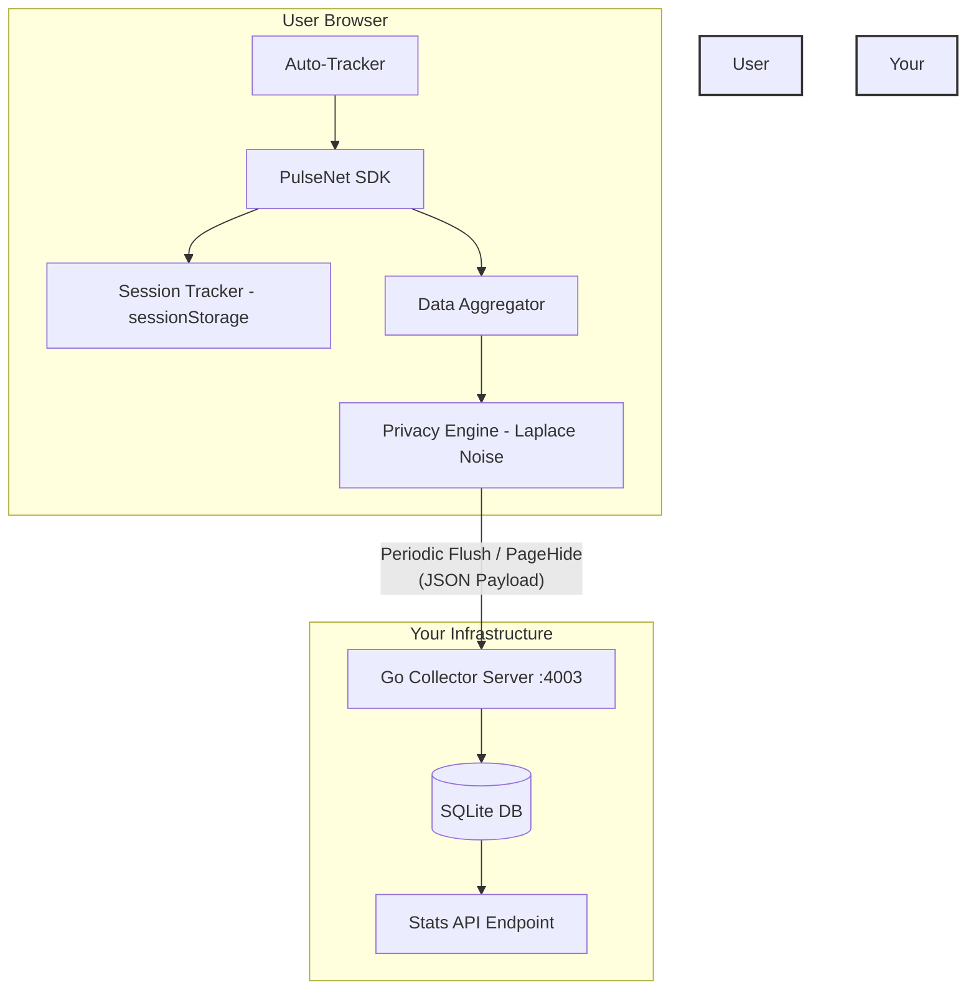

<!--
// Copyright (c) 2024-2026 Soumya Debnath. All Rights Reserved.
// Dual-licensed: AGPL-3.0-or-later (free, see LICENSE) OR a commercial licence
// (see COMMERCIAL_LICENSE.md) if you cannot meet the AGPL's source-disclosure terms.
// Contact: soumyadebnath1661@gmail.com
-->

<div align="center">
  <h1>PulseNet</h1>
  <p><strong>PulseNet aggregates product analytics with differential privacy applied in the browser, so you can read population-level trends without collecting any individual user's raw events.</strong></p>

  [](https://www.gnu.org/licenses/agpl-3.0)
  [](#known-limitations)
  [](#privacy-architecture)
  [](#gdprccpa-compliance)
</div>

---

## Table of Contents
1. [What is PulseNet?](#what-is-pulsenet)
2. [Why PulseNet? (Cost & Comparison)](#why-pulsenet-cost--comparison)
3. [Architecture](#architecture)
4. [Privacy Architecture & Differential Privacy](#privacy-architecture--differential-privacy)
5. [Why Ad Blockers Can't Block It](#why-ad-blockers-cant-block-it)
6. [GDPR & CCPA Compliance](#gdpr--ccpa-compliance)
7. [Installation & Setup](#installation--setup)
8. [Usage Examples](#usage-examples)
9. [API Reference](#api-reference)
10. [Aggregated Payload Specification](#aggregated-payload-specification)
11. [Server Deployment & API](#server-deployment--api)
12. [Known Limitations](#known-limitations)
13. [FAQ](#faq)
14. [Author & Support](#author--support)

---

## What is PulseNet?

PulseNet is a complete, self-hosted, privacy-first analytics alternative to Google Analytics, Mixpanel, and Amplitude. It provides you with rich, actionable insights about your users without ever tracking an individual user, placing a cookie, or collecting Personally Identifiable Information (PII).

**Key Innovations:**
- **On-Device Aggregation:** Data is aggregated on the user's browser over an interval.
- **Differential Privacy (Laplace Noise):** We inject cryptographic noise on the client before the data ever touches your server.
- **Zero Cookies / Zero PII:** We use ephemeral `sessionStorage` strictly for tracking active session time. We do not fingerprint, track IPs, or use third-party cookies.
- **Impossible to Block:** Because it runs on first-party domains and doesn't load external tracking scripts, uBlock Origin and Brave Shields won't block it.
- **Zero Cost:** Deploy the ultra-lightweight Go server anywhere (fly.io, Render, your own VPS) for pennies or completely free.

---

## Why PulseNet? (Cost & Comparison)

Tired of paying thousands of dollars for Mixpanel, or dealing with the bloated, privacy-invasive nightmare of Google Analytics 4?

### The Cost Savings
| Monthly Tracked Users | Google Analytics 360 | Mixpanel | Plausible / Fathom | **PulseNet** |
|-----------------------|----------------------|----------|--------------------|--------------|
| 10,000                | Free (Invasive)      | Free     | ~$14/mo            | **$0**       |
| 100,000               | Free (Invasive)      | $20+/mo  | ~$49/mo            | **$0**       |
| 1,000,000             | Free (Invasive)      | $1000+/mo| ~$150+/mo          | **$0 (or $5 VPS)** |
| 10,000,000            | $150,000/yr          | Custom   | Custom             | **$0 (or $20 VPS)** |

### Feature Comparison

| Feature                     | PulseNet           | Google Analytics   | Mixpanel         | Plausible       |
|-----------------------------|--------------------|--------------------|------------------|-----------------|
| **Data Ownership**          | 100% Yours         | Google's           | Mixpanel's       | Cloud / Yours   |
| **Differential Privacy**    | Yes                | No                 | No               | No              |
| **Cookie-free**             | Yes (always)       | No (usually)       | No (usually)     | Yes             |
| **GDPR/CCPA compliant**     | Yes (by design)    | Requires config    | Requires config  | Yes             |
| **Bypasses Ad Blockers**    | Yes (1st party)    | Blocked            | Blocked          | Partially       |
| **SPA / History API Ready** | Automatic          | Manual config      | Manual config    | Yes             |

---

## Architecture

PulseNet consists of two primary components:
1. **The Client SDK (TypeScript):** Runs in the browser, aggregates data, applies Laplace noise, and flushes payloads periodically or on page close.
2. **The Collector Server (Go):** Extremely fast, lightweight SQLite-backed server that ingests pre-aggregated, anonymized payloads.



---

## Privacy Architecture & Differential Privacy

PulseNet applies a Laplace mechanism to count metrics on-device, before any data is transmitted. Read the
caveats in this section and in [Known Limitations](#known-limitations) carefully: the noise mechanism itself
is correctly calibrated, but PulseNet does **not** currently implement privacy budget accounting or
per-client contribution clipping, which are both required for an end-to-end ε-differential-privacy claim.

### How it works:
Instead of sending real-time events (e.g., "User A clicked Button B at 10:04 AM"), PulseNet accumulates events in memory for a period (e.g., 60 seconds). Before sending this aggregated data to the server, it applies **Laplace Noise**.

### The Math:
For any count metric (page views, event clicks, sessions), the reported value is:
`Reported Value = True Value + Laplace(0, Δf / ε)`

- `Δf` (Sensitivity): the maximum change a single user can have on the output. PulseNet **passes `Δf = 1` to
  the noise function but does not enforce it** — there is no per-client contribution clipping, so a client
  that records N events against the same key moves that count by N. The effective privacy loss for such a
  client is `N · ε`, not `ε`. See [Known Limitations](#known-limitations).
- `ε` (Epsilon): the privacy parameter. Lower epsilon means more privacy (more noise). PulseNet uses
  `ε = 1.0`. **Epsilon is currently hardcoded and cannot be configured** through `PulseNetOptions`.
- Noise is sampled by inverse transform sampling seeded from `crypto.getRandomValues()` (`Math.random()` is
  only a fallback when the Web Crypto API is unavailable):
  ```typescript
  // src/privacy.ts — scale is sensitivity/epsilon
  const scale = sensitivity / Math.max(epsilon, 1e-5);
  let u = getSecureRandom() - 0.5;               // crypto-backed
  const noise = scale * Math.sign(u) * Math.log(1 - 2 * Math.abs(u));
  return Math.max(0, Math.round(value + noise)); // clamped to a non-negative integer
  ```

The Laplace scale is correctly calibrated to `sensitivity / epsilon`. Two caveats to understand before
relying on this:

- The final `Math.max(0, …)` clamp truncates the negative half of the noise, so every reported count is
  **biased upward**. That bias does not average away as sample size grows — see the accuracy FAQ below.
- There is **no privacy budget accounting**. Each release draws independent noise, so repeated releases of
  the same underlying statistic do not compose the way ε-DP requires. See
  [Known Limitations](#known-limitations).

---

## Federated P2P Aggregation

PulseNet exports an experimental `FederatedAggregator` class that merges pre-noised aggregate buckets received
over an `RTCDataChannel`. It does not run by default when you instantiate `PulseNet`.

> **Scope, precisely.** `FederatedAggregator` **does not create any WebRTC connection.** There is no
> `RTCPeerConnection`, no `iceServers`/STUN/TURN configuration, and no secure-aggregation or multi-party
> summation protocol in this repository. You must establish the peer connection and data channel yourself and
> pass the open channel to `addPeer(channel)`. `connect()` only opens a WebSocket to a signaling URL and
> re-dials every 5 seconds indefinitely (no backoff, no cancellation handle). Merging is a plaintext weighted
> average that trusts the peer-supplied `contributorCount`, and calling `updateLocal()` currently overwrites
> previously merged peer state. Do not rely on this for privacy or correctness.

### Research Foundations
> **Research Citations:**
> - Dwork, C., & Roth, A. (2014). *The Algorithmic Foundations of Differential Privacy*. Foundations and Trends in Theoretical Computer Science, 9(3-4), 211-407.
> - Bonawitz, K., et al. (2017). *Practical Secure Aggregation for Privacy-Preserving Machine Learning*. ACM CCS 2017. [arXiv:1611.04482](https://arxiv.org/abs/1611.04482)

---

## Why Ad Blockers Can't Block It

Traditional analytics like Google Analytics load external scripts (e.g., `www.google-analytics.com/analytics.js`). Ad blockers maintain lists (like EasyPrivacy) of these domains and block them entirely.

**PulseNet bypasses this because:**
1. **It's bundled in your app:** You import PulseNet directly into your React/Vue/Vanilla JS app. There is no external `<script>` tag.
2. **It uses your domain:** You deploy the Go server to a subdomain (e.g., `analytics.example.com`) or proxy it through your main API. Ad blockers do not block first-party requests.
3. **No tracking payloads:** The payload looks like application metrics, not tracking data. No device IDs, user IDs, or IPs are sent.

---

## GDPR & CCPA Compliance

PulseNet is designed to **reduce your GDPR/CCPA scope** by minimising what is collected. It cannot make an
application compliant on its own — compliance is a property of your whole deployment, not of a library.

What the SDK does do:

- **No cookies.** `sessionStorage` is used only to measure how long a single tab session lasts, and the browser
  clears it when the tab closes.
- **No user IDs, no PII fields.** The SDK sends no email, name, user ID or device ID, and the payload contains
  no per-event records — only counts and percentiles per flush window.
- **No persistent fingerprint.** `getDeviceCategory()` reads `navigator.userAgent` to bucket the client as
  `mobile`/`tablet`/`desktop`. That is a single coarse value, not a fingerprint, but it *is* a read of the UA
  string.

What PulseNet does **not** do, and you remain responsible for:

- **IP addresses.** The SDK never sends an IP, but your collector necessarily receives one with every HTTP
  request. PulseNet performs **no IP truncation, anonymisation, or scrubbing** — configure that at your
  reverse proxy, and check your access-log retention.
- **Consent.** There is no consent gate, no Do-Not-Track handling and no `enable()`-by-default-off mode. Note
  that ePrivacy Directive Art. 5(3) governs *any* storage in a user's terminal equipment, not only cookies,
  so the `sessionStorage` write is not automatically exempt. **Whether you need a consent banner is a legal
  question for your counsel — this README cannot answer it for you.**
- **Data-subject requests / retention.** The collector has no deletion endpoint and no retention limit; rows
  accumulate indefinitely in SQLite. Aggregates keyed by `appId` with timestamps, exact referrer hostnames and
  exact timing percentiles are stored verbatim. You must implement your own retention and erasure process.
- **The unnoised fields.** `referrers`, all `timing` percentiles, `sessions.avgDurationSec`,
  `sessions.bounceRate` and `devices` are transmitted without noise. At low traffic these can be
  attributable to individuals.

---

## Installation & Setup

> **PulseNet is not published on npm.** The package name `pulsenet` is not registered. Do not run `npm install pulsenet`.

### Option A: jsDelivr CDN from GitHub (no build step)

```html
<script type="module">
  import { PulseNet } from 'https://cdn.jsdelivr.net/gh/itsoumya-d/pulsenet@main/dist/index.mjs';

  const analytics = new PulseNet({
    appId: 'my-production-app',
    endpoint: 'https://analytics.example.com/api/collect',
  });
</script>
```

### Option B: Classic `<script>` tag (IIFE global build)

`dist/index.global.js` is a browser global build. It attaches a **namespace object** (not the class itself) to
`window.PulseNet`, so the constructor is `PulseNet.PulseNet`:

```html
<script src="https://cdn.jsdelivr.net/gh/itsoumya-d/pulsenet@main/dist/index.global.js"></script>
<script>
  // note the double reference: the global is the module namespace
  var analytics = new PulseNet.PulseNet({
    appId: 'my-production-app',
    endpoint: 'https://analytics.example.com/api/collect',
  });
</script>
```

### Option C: Build from source

```bash
git clone https://github.com/itsoumya-d/pulsenet.git
cd pulsenet
npm install
npm run build
```

Then import from `./dist/index.mjs` in your project.

### Basic Initialization

Initialize PulseNet as early as possible in your application lifecycle.

```typescript
import { PulseNet } from './dist/index.mjs';

const analytics = new PulseNet({
  appId: 'my-production-app',
  endpoint: 'https://analytics.example.com/api/collect',
  flushInterval: 60000, // Aggregate and send every 60 seconds
  debug: process.env.NODE_ENV !== 'production'
});
```

---

## Usage Examples

### Basic Tracking

PulseNet automatically hooks into the History API and window load events. Page views and initial performance metrics are tracked automatically!

### Tracking Custom Events

Track interactions, button clicks, or application states.

```typescript
// User signs up
analytics.track('user_signup');

// User upgrades plan
analytics.track('plan_upgraded');

// User clicks a critical CTA
document.getElementById('checkout-btn').addEventListener('click', () => {
  analytics.track('checkout_clicked');
});
```
*Note: Custom properties on events are intentionally omitted in the current SDK to maintain Differential Privacy guarantees.*

### Single Page Applications (SPA) Support

PulseNet patches `history.pushState` and listens to `popstate` events. If you are using React Router, Next.js, or Vue Router, **you do not need to do anything**. Page views are recorded automatically.

If you need to manually trigger a page view:
```typescript
analytics.pageView('/custom/virtual/path');
```

### Custom Timing Metrics

Track how long certain operations take:
```typescript
const start = performance.now();
// ... heavy computation or API call ...
const end = performance.now();

analytics.timing('api_latency', 'fetch_users', end - start);
```

---

## API Reference

### `class PulseNet`

**Real package name: `pulsenet`** (not `@pulsenet/browser` or `@pulsenet/core` — those do not exist).

#### `constructor(options: PulseNetOptions)`
Initializes the SDK.
- `options.appId` (string, required): A unique identifier for your app.
- `options.endpoint` (string, required): The URL of your PulseNet Go Collector server.
- `options.flushInterval` (number, optional): Milliseconds between data flushes. Default: `60000`.
- `options.debug` (boolean, optional): Enable console logging. Default: `false`.

#### `track(event: string)`
Records a custom event. The count of this event will be aggregated, noised, and sent during the next flush.

#### `pageView(path?: string)`
Records a page view. If `path` is omitted, it defaults to `window.location.pathname`. Also captures `document.referrer`.

#### `timing(category: string, variable: string, durationMs: number)`
Records a timing metric. The SDK will compute p50, p95, and p99 percentiles locally before flushing.

#### `enable() / disable()`
Temporarily pause or resume tracking.

#### `flush()`
Manually forces the aggregator to calculate noise and send the payload immediately. (Automatically called on `pagehide` / `visibilitychange`).

#### `destroy()`
Clears timers, flushes remaining data, and cleans up the SDK.

### `class FederatedAggregator`

Experimental class for gossip-based P2P pre-aggregation. Not enabled by default.

- `connect(signalingUrl: string, channelId: string)`: Connect to a signaling server for peer discovery.
- `addPeer(channel: RTCDataChannel)`: Register a WebRTC data channel with a peer.
- `shareLocalAggregates(epsilon?: number, sensitivity?: number)`: Broadcast noised local aggregates to connected peers.
- `receivePeerData(msg: GossipMessage)`: Merge a peer's aggregate into the global aggregate.
- `getGlobalAggregate()`: Get the current merged aggregate.

---

## Aggregated Payload Specification

When PulseNet flushes data, it sends a POST request with an `application/json` body. Here is exactly what the
server sees — counts and percentiles per flush window, with no per-event records.

> **Which fields carry noise:** only `pageViews`, `events` and `sessions.count`. The values in `timing`,
> `referrers`, `devices`, `sessions.avgDurationSec` and `sessions.bounceRate` are sent **verbatim**. The
> `noiseLevel` field reports the epsilon used for the three noised fields only.

```json
{
  "appId": "my-production-app",
  "period": {
    "start": 1690000000,
    "end": 1690000060
  },
  "pageViews": {
    "/home": 45,
    "/pricing": 12
  },
  "events": {
    "checkout_clicked": 8,
    "signup_completed": 3
  },
  "sessions": {
    "count": 15,
    "avgDurationSec": 240,
    "bounceRate": 0.25
  },
  "timing": {
    "performance:page_load": {
      "p50": 340,
      "p95": 890,
      "p99": 1200
    }
  },
  "referrers": {
    "google.com": 8,
    "twitter.com": 4
  },
  "devices": {
    "desktop": 1
  },
  "noiseLevel": 1.0
}
```

---

## Server Deployment & API

The PulseNet backend is a Go server using SQLite. It compiles to a single binary.

### 1. Build and Run via Docker

A `Dockerfile` is included in the `/server` directory.

```bash
cd server
docker build -t pulsenet-server .
docker run -p 4003:4003 -v "$(pwd)/data:/app" pulsenet-server
```
> **Mount `/app`, not `/app/data`.** The server opens the *relative* path `pulsenet.db` and the image sets
> `WORKDIR /app`, so the database is created at `/app/pulsenet.db`. Mounting a volume at `/app/data` leaves
> the database inside the container's writable layer, and **all collected analytics are lost on every
> container restart.**

### 2. Run locally (Go required)

```bash
cd server
go mod download
go build -o pulsenet-server
./pulsenet-server
```
*Starts server on port `:4003`.*

### REST API Endpoints

#### `GET /api/stats?appId={appId}`
Returns total aggregated page views and events across all time.

#### `GET /api/sessions?appId={appId}`
Returns session metrics.

#### `POST /api/collect`
The ingestion endpoint used by the SDK. Expects the `PulseNetPayload`.

---

## Known Limitations

- **Pre-release software.** API may change. No production adopters are known yet.
- **Not published on npm.** The package name `pulsenet` on npm is not registered. Use jsDelivr CDN or build from source (see Installation).
- **No privacy budget enforcement.** `src/privacy.ts` contains a `PrivacyBudgetTracker`, but neither
  `addLaplaceNoise` nor `addGaussianNoise` calls it, and it is not exported from `src/index.ts`. Nothing
  limits how many noised releases are produced, so the ε value is a per-release parameter, not a cumulative
  budget. Do not describe a PulseNet deployment as providing an end-to-end ε-DP guarantee.
- **Sensitivity is assumed, not enforced.** There is no per-client contribution clipping anywhere. A single
  client recording N events against one key has that count released with noise calibrated for `Δf = 1`.
- **Counts are biased upward, not merely noisy.** The `Math.max(0, …)` clamp in `addLaplaceNoise` removes the
  negative half of the noise distribution. Because the collector sums payloads, this bias accumulates
  linearly with the number of contributing clients. See the accuracy FAQ.
- **Only three fields are noised.** `pageViews`, `events` and `sessions.count` receive Laplace noise.
  `sessions.avgDurationSec`, `sessions.bounceRate`, all `timing` percentiles, `referrers` and `devices` are
  transmitted **verbatim**. A `p95`/`p99` over a small sample is close to an order statistic and can reveal
  one individual's exact measurement.
- **`FederatedAggregator` does not create peer connections.** It contains no `RTCPeerConnection`, no ICE or
  STUN/TURN configuration, and no secure-aggregation protocol. You must construct the
  `RTCPeerConnection` and `RTCDataChannel` yourself and hand the channel to `addPeer()`. Peer merging is a
  plaintext weighted average that trusts the peer-supplied `contributorCount`, and `updateLocal()` currently
  overwrites previously merged peer state. Treat it as an unfinished experiment.
- **Idle tabs still transmit.** Because `sessions.count` is `Math.max(0, round(0 + Laplace(1)))`, roughly 30%
  of flush intervals with no activity still emit a payload reporting a non-zero session count.
- **`history.pushState` is not restored by `destroy()`.** Each `new PulseNet()` wraps `pushState` again, and
  `destroy()` does not unwrap it, so repeated mount/unmount cycles (React StrictMode, HMR) inflate page views.
- **No input validation.** A missing or misspelled `endpoint` results in a POST to the relative URL
  `undefined`; the failure is swallowed unless `debug: true`.
- **Browser-only SDK.** Node.js is not supported (the SDK references `window`, `document`, `sessionStorage`).
- **Go server required for data persistence.** The client-side SDK alone does not store or visualize data.
- **Collector read endpoints are unauthenticated.** `GET /api/stats`, `/api/events` and `/api/sessions`
  require only an `appId`, which is public by construction. Put them behind a reverse proxy with
  authentication before exposing the collector to the internet.
- **Differential Privacy noise at low volumes.** With fewer than ~100 events per flush interval, Laplace noise
  adds substantial inaccuracy. This is expected behavior, not a bug.

---

## FAQ

**Q: If the data has random noise, how inaccurate is it?**
A: More inaccurate than you might expect, and biased in one direction. Each *client* noises its own aggregate
independently and the collector sums those payloads, so the error grows with the number of contributing
clients rather than averaging away:

| Contributing clients (1 view each) | True total | Typical reported total | Mean absolute error |
|---|---|---|---|
| 100 | 100 | ~118 | ~18 |
| 1,000 | 1,000 | ~1,179 | ~179 |
| 10,000 | 10,000 | ~11,767 | ~1,767 |
| 100,000 | 100,000 | ~117,660 | ~17,660 |

Two effects combine. First, summing N independent `Laplace(1)` draws gives a random error with standard
deviation `sqrt(2N)` — about ±141 at N = 10,000, not ±3. Second, and larger: the `Math.max(0, …)` clamp
truncates negative noise, so `E[reported | true = 1] ≈ 1.18` rather than 1.0, producing a systematic **~18%
upward bias** that does *not* cancel out at scale. Treat PulseNet counts as directional trend indicators, not
as accurate totals. Reproduce these figures by sampling `addLaplaceNoise(1, 1, 1.0)` and summing.

**Q: What happens if a user closes the tab before the 60-second flush interval?**
A: The SDK hooks into the `visibilitychange` and `pagehide` browser events. When the user navigates away or closes the tab, a final payload is instantly dispatched using the `navigator.sendBeacon()` API (or a keepalive `fetch`), ensuring zero data loss.

**Q: Can I use this with Next.js or Nuxt?**
A: Yes. Simply instantiate the PulseNet class in a client-side `useEffect` or `onMounted` hook.

**Q: Does the backend support Postgres or MySQL?**
A: Not currently. The backend uses `modernc.org/sqlite` for simplicity and CGO-free deployment. Note that WAL
mode is **not** enabled — `NewStore` opens the database with no `journal_mode` pragma — and `GetPayloads`
loads every row for an `appId` into memory on each stats request, with no retention policy or pagination.
Both are worth addressing before running this at volume.

---

## Author & Support

**Soumya Debnath**
- Email: [soumyadebnath1661@gmail.com](mailto:soumyadebnath1661@gmail.com)
- Phone:

---

## 📄 License

**Dual-licensed — choose either:**

1. **[AGPL-3.0-or-later](LICENSE)** — free for any purpose, including commercial and production
   use. No payment, no permission, no key required. The obligation it carries: if you modify this
   software and let users interact with it over a network, you must offer those users your modified
   source under the same licence.

2. **[Commercial licence](COMMERCIAL_LICENSE.md)** — for organisations that cannot or prefer not to
   meet the AGPL's source-disclosure obligation. This buys an exception, not access.

Contributions are accepted under AGPL-3.0-or-later.

